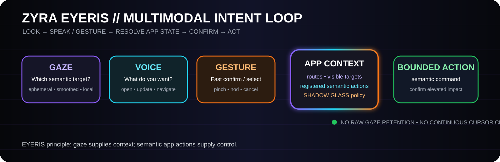

<div align="center">

# EYERIS // VA3LM GEOVISION

**Multimodal, app-aware gaze + voice + gesture control with non-identifying visual intelligence and Foundry-ready geospatial context.**

`IMPLEMENTED` · `MULTIMODAL` · `NON-IDENTIFYING` · `APP-AWARE` · `WGS84` · `FOUNDRY READY`

</div>



## 👁️ What EYERIS is becoming

EYERIS is no longer just a visual object-detection service. The interaction layer now follows a **multimodal intent** model:

```text
LOOK at something meaningful
        ↓
EYERIS resolves the semantic app target
        ↓
SPEAK what you want or use a gesture
        ↓
SHADOW GLASS checks authority / impact
        ↓
GLASS ONION records the decision path
        ↓
THE APP executes a bounded semantic action
```

### Why this feels better than an eye-controlled mouse

A raw gaze mouse tries to keep a pointer attached to every tiny eye movement. That creates jitter, overshoot, dwell fatigue, and the feeling that the cursor is always chasing you.

EYERIS uses gaze as **context**, not as the final command.

- **Gaze:** which app object are you looking at?
- **Voice:** what do you want to do with it?
- **Gesture:** select / confirm / cancel quickly.
- **App state:** what actions are actually valid here?
- **SHADOW GLASS:** is the requested action allowed?
- **GLASS ONION:** what happened, with what evidence?

Full implementation guide: [docs/EYERIS-MULTIMODAL.md](docs/EYERIS-MULTIMODAL.md)

---

## ✅ What exists now

EYERIS currently contains two complementary capability planes.

### 1. Multimodal intent control

Implemented in [`src/eyeris/multimodal.py`](src/eyeris/multimodal.py):

- normalized gaze samples;
- low-pass smoothing for stable semantic targeting;
- app-declared semantic target registry;
- target hit testing and nearest-target recovery;
- overlapping-target priority;
- gaze + voice intent fusion;
- gaze + pinch/tap/nod selection;
- shake/cancel handling;
- confirmation flags for elevated-impact actions;
- audit records that omit raw gaze coordinates.

Tests: [`tests/test_multimodal.py`](tests/test_multimodal.py)

### 2. Geospatial visual intelligence

EYERIS also contains working Python contracts for camera metadata, object/scene detections, confidence filtering, normalized bounding boxes, WGS84 geospatial enrichment, an optional Ultralytics-compatible detector adapter, a container-friendly live inference service, a Docker runtime, Foundry Media Set and geospatial transforms, a Foundry container ModelAdapter, an Ontology contract, automated tests, and cross-platform CI.

The implementation plugs into the wider **SHADOW GLASS / GLASS ONION / GPT-DOUG-LLM / ZYRA / XUNIA / VA3LM / SONOXO** stack.

---

## 🧠 Beginner example

Imagine a maintenance dashboard with a row for **Pump 7**.

```text
1. You LOOK at the Pump 7 row.
2. EYERIS resolves target = pump-7.
3. You say: “open this.”
4. EYERIS checks that pump-7 exposes an `open` action.
5. The action is low impact, so it can execute immediately.
6. Audit records: target=pump-7, action=open, modalities=gaze+voice.
7. Raw eye coordinates are not written to the audit record.
```

For a higher-impact action:

```text
LOOK at release control
        +
SAY “submit this”
        ↓
EYERIS resolves semantic action
        ↓
SHADOW GLASS → CONFIRMATION REQUIRED
        ↓
No side effect until the approval gate passes
```

---

## 🧩 Multimodal code map

| Part | What it does |
|---|---|
| `src/eyeris/multimodal.py` | Gaze smoothing, semantic targets, voice/gesture intent fusion, bounded commands |
| `tests/test_multimodal.py` | Interaction, privacy, confirmation, and low-confidence gaze tests |
| `docs/EYERIS-MULTIMODAL.md` | Full design and next-layer architecture |
| `docs/assets/eyeris-multimodal-loop.svg` | Animated visual of the interaction loop |

## 🌍 Geovision code map

| Part | What it does |
|---|---|
| `src/eyeris/contracts.py` | Camera, Detection, bounding-box, timestamps, and privacy contracts |
| `src/eyeris/inference.py` | Standard detector interface and inference normalization |
| `src/eyeris/geospatial.py` | WGS84 camera-location enrichment |
| `src/eyeris/adapters/ultralytics_yolo.py` | Optional user-supplied object-detection weights |
| `src/eyeris/model_server.py` | `/health` + `/infer` container service |
| `Dockerfile.vision` | Linux container runtime for model hosting |
| `foundry/model_adapter/eyeris_container_adapter.py` | Palantir container-backed ModelAdapter |
| `foundry/pipelines/media_listing.py` | Media Set → image listing |
| `foundry/pipelines/geospatial_enrichment.py` | Camera metadata → geospatial detections |
| `foundry/ontology/eyeris-ontology.json` | Camera / Detection / review-action Ontology contract |
| `tests/test_geovision.py` | Reproducible core and privacy-boundary verification |

---

## 🛰️ Full EYERIS architecture

```text
                  ZYRA EYERIS
                       │
          ┌────────────┴────────────┐
          │                         │
  MULTIMODAL CONTROL         VISUAL INTELLIGENCE
          │                         │
 camera eye landmarks        authorized camera/image
          │                         │
 local gaze estimator        object + scene model
          │                         │
 ephemeral gaze point        detection / confidence
          │                         │
 gaze smoother               WGS84 enrichment
          │                         │
 semantic target registry    Foundry Ontology
          └────────────┬────────────┘
                       │
                 APP / MISSION STATE
                       │
              voice + gesture intent
                       │
                  SHADOW GLASS
                       │
                  GLASS ONION
                       │
             APP-NATIVE / AIP ACTION
                       │
              EVIDENCE + AUDIT
```

---

## 🎯 Design target

The target experience is:

> **Look at an object → say what you want → EYERIS understands the app context → execute the correct semantic action.**

For common operations, this should be faster and more reliable than asking an LLM to interpret screenshots or forcing the user to dwell-click tiny controls.

App-native actions are preferred. LLM reasoning is reserved for ambiguous or multi-step requests.

---

## 🛡️ Privacy boundary

EYERIS remains intentionally **non-identifying**.

Generic object and scene labels are supported, including generic `person` detections. The core rejects identity-oriented payload fields such as face embeddings, identity IDs, person names, and persistent subject identifiers.

For gaze interaction, the new privacy rule is also explicit:

- raw eye landmarks should remain local whenever possible;
- normalized gaze points are ephemeral interaction state;
- semantic target/action decisions can be audited;
- raw gaze histories are not retained by default;
- no biometric identity profile is created;
- outside-model egress must pass SHADOW GLASS policy.

The intended uses are accessibility, hands-free app control, authorized asset/site awareness, object counts, vehicles, equipment, hazards, occupancy, scene state, operations dashboards, maintenance workflows, and mission-support interfaces — not covert identity surveillance.

---

## 🏗️ Foundry architecture

Palantir models support imported container images plus model adapters for batch or live inference. The checked-in ModelAdapter maps Foundry tabular inputs to the EYERIS `/infer` service. Camera points are represented as Ontology `geopoint` values using WGS84 `latitude,longitude`; field-of-view geometry uses GeoJSON Geometry suitable for `geoshape`.

The multimodal layer is designed to map **semantic commands** into approved Ontology / AIP actions after identity, data scope, tool authority, and confirmation requirements pass SHADOW GLASS.

Full geovision implementation notes: [docs/FOUNDry_GEOVISION.md](docs/FOUNDry_GEOVISION.md)

---

## 🧪 Local verification

```bash
python -m pip install '.[dev]'
python -m pytest -q
python -m compileall -q src
```

Optional local object detector runtime:

```bash
python -m pip install '.[vision,server]'
export EYERIS_MODEL_PATH=/path/to/authorized/object-detection-weights.pt
uvicorn eyeris.model_server:app --host 0.0.0.0 --port 8080
```

---

## 🚀 Next build layers

1. **Web/React adapter** — register visible React components and semantic actions.
2. **Local gaze provider** — replaceable webcam/eye-landmark adapter.
3. **Live target highlight** — immediate visual focus feedback without cursor chasing.
4. **Voice runtime** — speech transcript → semantic action.
5. **Gesture runtime** — pinch, nod, shake and optional accessibility mappings.
6. **Target hysteresis** — prevent adjacent controls from rapidly stealing focus.
7. **Per-user calibration** — smoothing, target expansion, head-pose tolerance and modality preferences.
8. **AIP action bridge** — map approved commands to governed Ontology Actions.
9. **ZYRA shell integration** — one multimodal control layer across ZYRA surfaces.

---

## Status language

- **Implemented:** present in source code.
- **Verified:** exercised by reproducible tests/CI.
- **Foundry-ready:** code shape and adapter contracts exist for Foundry integration.
- **Deployed:** only after the target environment has actually run the model, transforms, Ontology, multimodal client, and app integration.

EYERIS multimodal semantic control is now **implemented in GitHub**. Full hands-free camera/voice/gesture operation still requires the live client adapters and calibration layers listed above.
