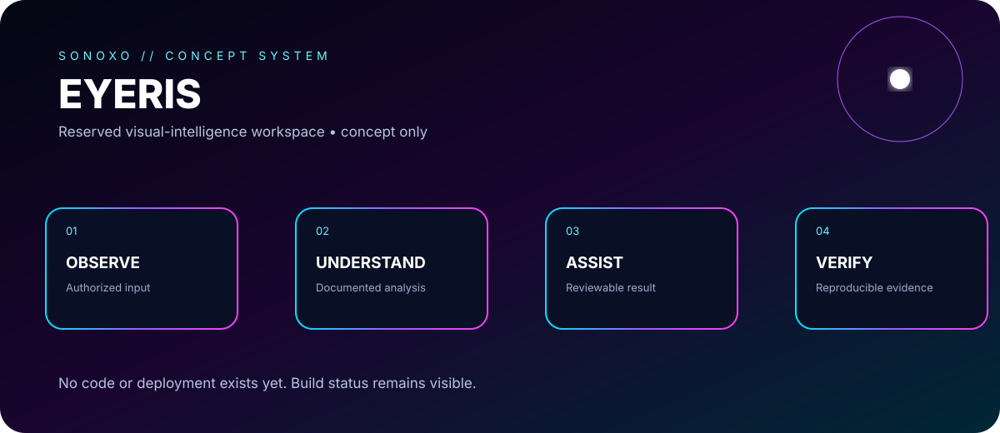

# EYERIS

**A reserved Sonoxo ecosystem workspace for a future visual-intelligence experience.**

`EMPTY REPOSITORY` · `CONCEPT STAGE` · `NO IMPLEMENTED FEATURES`

## What exists today

This repository is intentionally transparent: it currently contains no application code, model, API, dataset, build, test, or deployment. The README and system visual establish a clear starting point; they do not claim a working product.

## Proposed beginner flow

| Stage | Meaning |
|---|---|
| Observe | Accept an explicitly authorized input. |
| Understand | Interpret it using documented rules or models. |
| Assist | Present a useful, reviewable result. |
| Verify | Keep evidence of what ran and how it was checked. |

## Completion gates

Before EYERIS can be described as functional, it needs:

- a written product scope and privacy boundary;
- a chosen application and model architecture;
- source code with documented setup;
- automated tests and a successful build;
- security and accessibility review;
- an observed deployment with no invented status claims.

## Safety and privacy

Any future camera, image, biometric, health, or identity capability must require clear user authorization, minimize retention, document limitations, and avoid covert surveillance. Secrets and private data must never be committed.

## Sonoxo status language

- **Concept:** an idea or proposed flow.
- **Implemented:** present in code.
- **Verified:** exercised by a reproducible test.
- **Deployed:** observed in the target environment.

EYERIS is currently **Concept** only.
